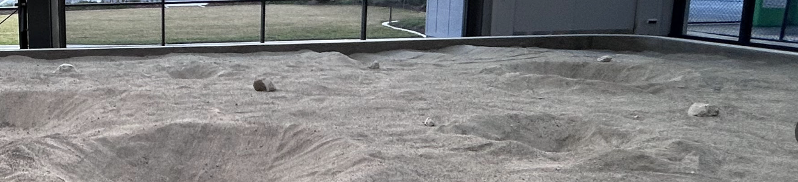

# Bound and Edge Detector for MGV Operating in the Lunar Sandpit

 [](https://www.gnu.org/licenses/gpl-3.0)

**Robotics and Autonomous Systems Group, Research Engineering Facility, Research Infrastructure**
**Queensland University of Technology**

## Introduction

The Bound and Edge Detector is a ROS 1 node that is designed as a navigation aide for autonomous mobile ground vehicles moving around in an experimental "sandbox". The node uses a front-mount depth camera to detect the walls of the sandbox and to estimate the distance. The wall interior surface is assumed to be vertical and perpendicular to the ground, within a range that can be specified as a parameter. 



The node requires a depth map from a RGBD camera, and the optional `CameraInfo`, as the input. The depth map is a regular pointcloud and the `CameraInfo` is for distortion correction, which improves the distance estimation accuracy when the wall is close. The node publishes a laser scan indicating a wall (i.e., the bound or the edge) that satisfies conditions, namely the minimum height, and the unit normal vector of the detected object indicating a vectical surface. The latter is expressed as maximum pitch (the wall is not strictly vertical), and minimum yaw (the wall is at an angle to the line of sight). 

The node also publishes a floating point number that indicates the estimated nearly distance of the wall. If there are more than one wall in sight, the node will select the closer one.

Note: This package is yet to be tested on a real MGV at the lunar facility of QUT.

## ROS Integration

ROS Integration is straight forward. The output is a `LaserScan` that indicates the locations of the wall. It is expected that this output can be fused with the other sensory detection of other obstacles, before fed into a mapping node. In addition, the other output is a distance from the nearest wall that can be handy as a signal in a navigation state machine. 

### Parameters

The Detection is customizable through various parameters. The parameters may be specified as private ROS parameters (read through the `rospy.get_param()` function calls) and as keyword parameters in instantiate an object of the main class `BoundDetector` in the executable program file `/nodes/bound_detector.py`.

### Input ROS Topics

| Name | Default | Remarks |
| ---- | ---- | ---- |
| depth_image_topic_name | /camera/depth/image_raw | The depth map (Image) |
| camera_info_topic_name | /camera/depth/camera_info | The camera intrinsics for distortion correction (CameraInfo) |

A None value for the above input ROS topic parameters implies that the input is not used.

### Output ROS Topics

| Name | Default | Remarks |
| ---- | ---- | ---- |
| laserscan_out_topic_name | /bound_detector/laser_scan | The combined laser scan output topic (LaserScan) |
| laser_frame_id | combined_laser | The frame id of the simulated source of the laser scan output |
| collision_warn_topic_name | /bound_detector/collision_warn | The topic that output messages of distance from the nearest wall (Float32) |

Note that `collision_warn_topic_name` outputs -1 if there is no wall nearby

### Option Output ROS Topics and Debug Output

| Name | Default | Remarks |
| ---- | ---- | ---- |
| normal_map_topic_name | None | The normal of detected surfaces in the depth map (Image) |
| normal_map_show | False | Whether to display the normal map in a window |

### Parameters for the Bound Detection Method

| Name | Default | Remarks |
| ---- | ---- | ---- |
| bound_min_height | 0.1 | The minimum height of the bound in meters |
| bound_max_pitch | 0.1 | The max pitch allowed if a surface is considered as the bound (range 0 to 1 in a unit normal vector) |
| bound_min_yaw | 0.5 | The min yaw allowed if a surface is considered as the bound (range 0 to 1 in a unit normal vector) |

Note that a yaw of 0.0 in a unit normal vector is a surface that runs parallel to the line of sight and a yaw of 1.0 is a surface that is perpendicular to the line of sight.

### Parameters for the Output LaserScan

| Name | Default | Remarks |
| ---- | ---- | ---- |
| update_rate | 15 | The rate of publishing the output LaserScan (Hz) |
| laser_samples | 240 | The number of laser scan samples of each `LaserScan` message |
| laser_min_angle | -2.0 | The lower end of the angle range of the output laser scan (radians) |
| laser_max_angle | 2.0 | The upper end of the angle range of the output laser scan (radians) |
| laser_range_min | 0.1 | The nearest end in the valid range of the output laser scan (meters) |
| laser_range_max | 100 | The furthest end in the valid range of the output laser scan (meters) |

### Specifying Parameters in a Launch File

A sample launch file `default.launch` is provided as an example of how to specify the parameters.

```xml
<launch>
  <node name="bound_detector" pkg="mgv_bound_detector" type="bound_detector.py" respawn="false" output="screen">
    <param name="laserscan_out_topic_name" value="/bound_detector/laser_scan "/>
    <param name="collision_warn_topic_name" value="/bound_detector/collision_warn "/>
    <!-- <param name="normal_map_topic" value="/bound_detector/normal_map"/>
    <param name="normal_map_show" value="True"/> -->

    <!-- <param name="bound_min_height" value="0.1" />
    <param name="bound_max_pitch" value="0.1" />
    <param name="bound_min_yaw" value="0.5" /> -->

    <param name="laser_samples" value="240" />
    <!-- <param name="laser_min_angle" value="-3.14" />     
    <param name="laser_max_angle" value="3.14" />     
    <param name="laser_range_min" value="1" />     
    <param name="laser_range_max" value="10" /> 
    <param name="update_rate" value="10" />   -->
  </node>  

</launch>
```

### Specifying Parameters in Python 

The Detector may be executed as a ROS node through your own Python program. It is as simple as initializing the program as a ROS node and then instantiate an object of the class `BoundDetector`.

```python
    rospy.init_node(BoundDetector.NODE_NAME)
    try:
        rospy.loginfo(f'BoundDetector: The node "{BoundDetector.NODE_NAME}" is running')
        robot_agent = BoundDetector()
        rospy.spin()
    except rospy.ROSInterruptException as e:
        rospy.logerr(e)
```

The Combiner parameters may be specified through keywords in the call to the constructor. Note that the Combiner parameters specified as keyword parameters of the constructor can be overruled by ROS parameters.

```python
    rospy.init_node(BoundDetector.NODE_NAME)
    try:
        rospy.loginfo(f'BoundDetector: The node "{BoundDetector.NODE_NAME}" is running')
        robot_agent = BoundDetector(laser_samples=320, normal_map_topic_name=`/bound_detector/normal_map`)
        rospy.spin()
    except rospy.ROSInterruptException as e:
        rospy.logerr(e)
```

## Installation

This package should be installed under the `src` folder of a catkin workspace. Use an existing workspace or create a new one as follows.
```bash
cd ~
mkdir -p catkin_ws/src
```
Change directory to the `src` folder under the workspace.
```bash
cd catkin_ws/src
```
Clone this repository and the package is downloaded as a folder called `mgv_bound_detector`.
```bash
git clone https://github.com/REF-RAS/mgv_bound_detector.git
```
Build the package and launch the ROS node
```
cd ~/catkin_ws
catkin_make

roslaunch mgv_bound_detector default.launch
```
The node will wait for messages from the input sources if they are not already publishing in the ROS environment.


## The Method

The method adopted in the package is based on conventional object extraction by identifying the bound/wall based on its expected normal vector, which should have a pitch (angle) close to zero. The yaw (angle) 

The method has not included modelling of the roll/pitch/yaw (RPY) of the mobile ground vehicle.  However, if such a model exists, it can be easily used to compensate for the mis-alignment of the depth camera. A suggested extention to this package is adding a subscriber to read the RPY from a ROS message stream and to use it in error correction of the normal map.

## Developer

Dr Andrew Lui, Senior Research Engineer <br />
Robotics and Autonomous Systems, Research Engineering Facility <br />
Research Infrastructure <br />
Queensland University of Technology <br />

First version: 30 Jul 2024 <br />
Latest update: 28 Oct 2024